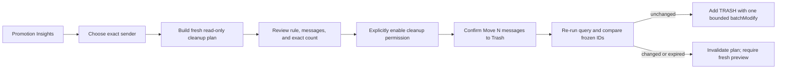

# Cleanup V1 design: exact-sender old promotions to Trash

Status: design only. This document does not authorize or implement a Gmail scope change or mutation.

## Product promise

Cleanup V1 lets an authenticated user choose one exact sender from Promotion Insights, build a fresh preview of old promotion messages currently matching that sender, review the frozen rule and exact bounded count, and explicitly confirm moving those messages to Gmail Trash.

The flow is:



Cleanup never uses the sampled message IDs from the bounded mailbox scan. The source scan establishes that an exact sender is eligible to be selected and supplies its frozen old-promotions cutoff. The cleanup preview always performs a new targeted Gmail query.

V1 supports one exact normalized sender address. It does not support a domain, display name, sender substring, unknown-sender bucket, arbitrary query, or multi-sender cleanup.

## Fixed safety limits

| Limit | V1 value | Behavior |
| --- | ---: | --- |
| Planned messages | **100 maximum** | A query that returns 101 IDs or a continuation token is too large. No executable plan is created. |
| Ready-plan lifetime | **10 minutes** | Starts when the complete preview becomes ready. Reading the plan does not extend it. |
| Active plans | **1 per account** | Creating another plan invalidates and clears the previous plan. |
| Mutation attempts | **3 maximum** | Includes ambiguous failures and retries; hidden client retries stay disabled. |
| Execution deadline | **2 minutes** | Includes drift check, quota waits, mutation attempts, and reconciliation. |
| Mutation batch size | **100 IDs maximum** | Deliberately below Gmail's 1,000-ID `batchModify` limit. |

One hundred messages is a sensible first blast-radius limit because it matches MailSweep's existing bounded scan scale, fits in one Gmail label mutation, remains reviewable, and prevents a high-frequency sender from turning one confirmation into a mailbox-scale action. V1 refuses an over-limit rule rather than silently taking the first 100 messages. A later milestone can add deliberate chunking after measuring actual use and recovery behavior.

Moving mail to Trash is reversible only for a limited time. Gmail says a user can recover a trashed message for up to 30 days, after which it is permanently deleted. The confirmation UI must state this consequence without offering an empty-trash action. [Gmail Help: delete messages](https://support.google.com/mail/answer/7401)

## Exact rule and query

The server builds the query. The client never supplies a Gmail query, cutoff, label list, action, or message IDs.

```text
from:"{normalizedExactAddress}"
category:promotions
before:{sourceScanTwoYearCutoffEpochSeconds}
-is:starred
-is:important
-in:sent
-in:drafts
-in:spam
-in:trash
```

The actual request is one space-separated string. It uses `IncludeSpamTrash=false` in addition to the explicit spam and trash exclusions. Gmail `messages.list` accepts Gmail search syntax, returns only IDs and thread IDs, supports at most 500 results per page, and does not provide message metadata. [Gmail `messages.list`](https://developers.google.com/workspace/gmail/api/reference/rest/v1/users.messages/list)

Query construction rules:

1. The request names a completed source scan and one exact sender address rendered in that scan's Promotion Insights.
2. The server looks up the source scan using the authenticated account ID. Another account receives `404`, not evidence that the scan exists.
3. The server compares the requested address with the normalized sender key stored in the source summary using ordinal comparison. Domain rows and the unknown-sender bucket are never accepted.
4. A dedicated query builder accepts only the normalized V1 address grammar, quotes and escapes it, and rejects unsupported address forms. It never concatenates raw UI text.
5. The cutoff is the source scan's frozen two-year cutoff, not the current time and not a client value. The scan result needs to retain this cutoff as server-owned rule data.
6. Preview requests at most 101 IDs. If Gmail returns 101 IDs or a next page token, the service records `tooLarge` and discards all IDs.
7. For 100 or fewer IDs, preview gets metadata for every ID using only `id`, `threadId`, `labelIds`, `internalDate`, `sizeEstimate`, and `From`/`Subject` headers. It never asks for snippets, bodies, parts, attachments, raw content, or unsubscribe headers.
8. Every message must still have the exact normalized `From` address, `CATEGORY_PROMOTIONS`, a date before the frozen cutoff, and none of `STARRED`, `IMPORTANT`, `SENT`, `DRAFT`, `SPAM`, or `TRASH`. An unavailable or unresolved message makes the preview unstable; it does not silently shrink an executable plan.

The metadata validation makes the exact-sender requirement independent of Gmail search matching details and closes ordinary list/get races before the plan is frozen.

## OAuth and permission escalation

### Recommendation

Keep the normal connection exactly as it is: identity scopes plus `gmail.readonly`. After a ready plan is visible, show why Trash access is needed and require a separate **Enable cleanup** action. That action uses the current `Google.Apis.Auth.AspNetCore3` incremental authorization support to require `gmail.modify` in context.

The installed library already exposes `IGoogleAuthProvider.GetCurrentScopesAsync()` and `RequireScopesAsync(...)`. The implementation should use those APIs rather than constructing authorization URLs or handling authorization codes itself. Google's OAuth guidance recommends incremental authorization so a scope is requested when the user invokes the feature that needs it, and `include_granted_scopes` combines the new grant with scopes already granted. [OAuth 2.0 for web server applications](https://developers.google.com/identity/protocols/oauth2/web-server) [OAuth policy](https://developers.google.com/identity/protocols/oauth2/policies)

The enable endpoint must:

- require the normal MailSweep session;
- accept only an owned, ready, unexpired plan ID;
- use a fixed callback and fixed frontend destination;
- preserve the plan ID in protected authentication state, never an arbitrary return URL;
- verify after callback that the Google subject is the same account that owns the plan;
- verify `gmail.modify` is actually present, because Google can return partial consent;
- return only `enabled`, `denied`, `expired`, or `failed` status to the browser;
- never return or log access tokens, refresh tokens, authorization codes, or Google error descriptions.

Do not request offline access for V1. Obtain a short-term credential at execution with enough remaining lifetime for the two-minute deadline, and do not store that credential in the cleanup plan. The current provider describes its credential as short-term and non-refreshable; this matches an in-memory, user-present action.

`gmail.modify` is a restricted Gmail scope. It allows the needed label mutation and does not allow immediate permanent deletion, but its published description is broader than Trash alone. Production use therefore requires an OAuth verification and data-handling review. [Gmail scopes](https://developers.google.com/workspace/gmail/api/auth/scopes)

Incremental authorization upgrades the user's Google grant and current authentication ticket; it cannot make the Google-issued credential itself Trash-only. MailSweep keeps the effective capability narrow by exposing only the fixed plan execution route and a Gmail source interface that can only add `TRASH`. Normal scans continue calling only list/get code. A custom second token store would add credential persistence and account-linking complexity without narrowing Google's `gmail.modify` scope, so it is not recommended for V1.

An implementation spike must confirm the Minimal API redirect behavior of `RequireScopesAsync`, the scopes recorded after callback, denial behavior, subject matching, and whether a later read-only reconnect returns previously granted scopes. This design branch does not change the configured scopes.

## Mutation choice

### Recommendation: `messages.batchModify` with `addLabelIds=["TRASH"]`

Gmail documents `TRASH` as a system label that can be manually applied. `messages.batchModify` can add a label to as many as 1,000 IDs in one request, requires `gmail.modify`, and returns an empty successful response. MailSweep sends at most 100 frozen IDs and only the `TRASH` label. [Manage labels](https://developers.google.com/workspace/gmail/api/guides/labels) [`messages.batchModify`](https://developers.google.com/workspace/gmail/api/reference/rest/v1/users.messages/batchModify)

| Choice | Calls for 100 messages | Current published quota units | Result detail | V1 assessment |
| --- | ---: | ---: | --- | --- |
| `messages.batchModify` + `TRASH` | 1 | 50 total | Empty success response; no per-ID result | Recommended: one bounded, idempotent label operation with low quota and latency. Reconcile ambiguous failures. |
| `messages.trash` per ID | 100 | 2,000 total | Returns each modified message | Clear per-message responses, but far more requests, latency, rate-limit exposure, and normal partial-progress states. |

The quota comparison uses the current official table: `messages.batchModify` costs 50 units per request and `messages.trash` costs 20 units per request. Google's per-user-per-project limit is currently 6,000 units per minute, with rollout notes for the quota model. [Gmail API usage limits](https://developers.google.com/workspace/gmail/api/reference/quota)

`messages.trash` is semantically explicit and would simplify per-ID result accounting, but V1's 100-call fan-out makes partial completion the normal failure shape. `batchModify` minimizes the mutation surface and is safe to retry because adding the same `TRASH` label again is idempotent. Gmail does not document per-ID results or an atomicity guarantee for `batchModify`, so MailSweep must not invent either guarantee.

This is the Gmail method named `batchModify`, not a multipart batch of 100 `messages.trash` requests. Multipart batching still counts each inner request and Google warns that large batches can trigger rate limits. [Gmail batch requests](https://developers.google.com/workspace/gmail/api/guides/batch)

## Contracts

The examples show the public shape. The server stores account ID, frozen Gmail IDs, set digest, and retry state internally. Message IDs never need to be returned to React.

### Create request

```json
{
  "sourceScanId": "scan-guid",
  "exactSenderAddress": "offers@example.com"
}
```

### Plan resource

```json
{
  "planId": "plan-guid",
  "revision": "opaque-random-revision",
  "status": "ready",
  "sourceScanId": "scan-guid",
  "rule": {
    "exactSenderAddress": "offers@example.com",
    "category": "oldPromotions",
    "before": "2024-09-21T13:00:00Z",
    "excluded": ["starred", "important", "sent", "drafts", "spam", "trash"],
    "action": "moveToTrash"
  },
  "observedQueryMatches": 3,
  "messageCount": 3,
  "messages": [
    {
      "receivedAt": "2024-01-10T12:00:00Z",
      "estimatedBytes": 42000,
      "from": "Example Offers <offers@example.com>",
      "subject": "January offers"
    }
  ],
  "cleanupAuthorization": "required",
  "createdAt": "2026-09-21T13:00:00Z",
  "expiresAt": "2026-09-21T13:10:00Z",
  "statusReason": null,
  "result": null
}
```

The preview may return all rows because the plan contains at most 100. The `messages` collection contains no ID, body, snippet, attachment, raw MIME, token, or unsubscribe data. `subject` and display-form `from` are already part of MailSweep's bounded metadata contract and remain in memory only.

### Execute request

```json
{
  "revision": "opaque-random-revision",
  "expectedMessageCount": 3,
  "confirmation": "moveToTrash"
}
```

The server requires exact matches for all three fields. The UI button itself reads **Move 3 messages to Trash**. A generic `confirmed: true` flag is insufficient because it does not bind confirmation to the reviewed revision and count.

### Execution result

```json
{
  "requestedCount": 3,
  "confirmedTrashedCount": 3,
  "notTrashedCount": 0,
  "unknownCount": 0,
  "outcome": "completed",
  "finishedAt": "2026-09-21T13:02:00Z"
}
```

`outcome` is `completed`, `partiallyCompleted`, or `unknown`. Counts reflect only what the service can confirm. Safe reason codes replace raw Gmail error text.

### Status model

`CleanupPlanStatus` is:

- `preparing`: the fresh query and metadata validation are running;
- `ready`: immutable preview available for confirmation;
- `tooLarge`: more than 100 query matches; never executable;
- `executing`: drift check or mutation in progress;
- `completed`: Gmail accepted the whole batch or reconciliation confirmed every ID in Trash;
- `partiallyCompleted`: reconciliation confirmed a mix of trashed and non-trashed/unknown IDs;
- `invalidated`: query membership changed or confirmation did not match the frozen plan;
- `expired`: ten-minute ready lifetime elapsed;
- `cancelled`: preview was cancelled before execution;
- `failed`: no safe executable plan/result could be produced.

## API routes

All responses use `Cache-Control: no-store`. All routes require the normal authenticated account. Every POST requires the exact configured frontend `Origin`; OAuth navigation uses protected state and a fixed return destination.

| Route | Request and response | Purpose |
| --- | --- | --- |
| `POST /api/mailbox/cleanup-plans` | Create request → `202 Accepted` + plan resource | Validate the source scan/sender and start a fresh read-only preview. |
| `GET /api/mailbox/cleanup-plans/{planId}` | Plan resource | Poll preparation, review the frozen plan, or read the execution result. |
| `POST /api/mailbox/cleanup-plans/{planId}/cancel` | Empty → `202 Accepted` | Cancel preparation and clear IDs; never cancels an executing Gmail mutation. |
| `GET /api/auth/google/cleanup/enable?planId={planId}` | Redirect or fixed frontend result | Explicit incremental `gmail.modify` authorization for one owned, ready plan. |
| `GET /api/auth/google/cleanup/status?planId={planId}` | `{enabled, planExpiresAt}` | Report capability without returning token or scope strings to React. |
| `POST /api/mailbox/cleanup-plans/{planId}/execute` | Execute request → `202 Accepted` + plan resource | Atomically claim the plan, recheck drift, and perform the bounded Trash operation. |

There is no route for arbitrary labels, arbitrary Gmail queries, message IDs, domain cleanup, untrash, empty Trash, `messages.delete`, `batchDelete`, or permanent deletion.

Use `404` for a missing or other-account plan, `409` for wrong state/revision/count, `410` for expiry, `422` for an unsupported sender or over-limit rule, and safe `503`/`429` responses for temporary capacity or Gmail failures. Exact status mapping should remain consistent across plan polling and execution.

## State and ownership

Implement an in-memory `CleanupPlanService` beside `MailboxScanService`; do not add a database for V1.

- Derive the owner from the same issuer plus subject identifier used for scans. Email address is display data, not the ownership key.
- Resolve the source scan through its owner-scoped service API and ensure it completed successfully.
- Store immutable frozen IDs and their digest only inside the plan service.
- Keep at most one preparing, ready, or executing plan per account and a small global capacity comparable to scan jobs.
- Do not run a scan and cleanup preview/execution concurrently for the same account. Return `409` so shared Gmail quota and UI state remain predictable.
- When a plan expires, immediately clear message IDs and preview headers. Retain only a small tombstone long enough to return `410` rather than `404`.
- An API restart invalidates every plan. The UI requires a fresh preview.
- Do not persist a Google credential, raw token, authorization code, Gmail response object, or message body.
- After any successful or partial mutation, mark the displayed mailbox scan stale and require a new scan before another sender can be selected.

Plan transitions occur under one service lock. Only `ready` can transition to `executing`, and that claim happens once. Concurrent or repeated execute requests return the current resource and never schedule a second mutation.

## Gmail boundaries

Keep preview reads and mutation authority separate even if they share low-level client construction.

```csharp
public interface IMailboxCleanupPreviewSource : IDisposable
{
    Task<MailboxIdPage> ListAsync(MailboxListRequest request, CancellationToken cancellationToken);
    Task<MailboxMessageMetadata> GetMetadataAsync(string messageId, CancellationToken cancellationToken);
}

public interface IMailboxTrashSource : IDisposable
{
    Task AddTrashLabelAsync(IReadOnlyList<string> messageIds, CancellationToken cancellationToken);
    Task<MailboxMessageMetadata> GetLabelStateAsync(string messageId, CancellationToken cancellationToken);
}
```

Names are illustrative. The important boundary is that cleanup code cannot ask for a general label mutation or permanent deletion. `AddTrashLabelAsync` always uses user `me`, validates 1–100 nonblank distinct IDs, hard-codes `addLabelIds=["TRASH"]`, sends no remove-label list, requests no response fields, and performs one HTTP attempt. Automatic Google client retries remain disabled so the cleanup engine owns attempt accounting.

Preview can reuse the existing read-only list/get adapter through a focused factory. Mutation uses a separate factory that first verifies the current account has `gmail.modify` and obtains a credential with enough remaining lifetime for execution. Both paths use the existing shared account/project quota limiter.

## Confirmation and drift checks

The following checks run in order after the user submits the count-bound confirmation and before any mutation:

1. Authenticate the normal MailSweep session and resolve the owner ID.
2. Atomically resolve an owned `ready` plan and reject expiry.
3. Compare the submitted opaque revision, exact message count, and `moveToTrash` confirmation literal.
4. Verify the incremental cleanup scope is present for the same Google subject.
5. Ensure no scan or other cleanup job is active for the account.
6. Transition the plan once to `executing`.
7. Re-run the exact frozen query with a 101-ID limit.
8. Compare sets, not enumeration order, against the frozen query ID set. Any addition, removal, continuation token, or list uncertainty invalidates the plan and performs zero mutations.
9. Immediately submit the immutable validated IDs to the Trash-only source.

The second query catches messages that were added, removed, starred, marked important, reclassified, sent/drafted, spammed, trashed, or otherwise changed enough to alter the rule. It also catches a query that crossed the blast-radius limit.

Gmail does not provide a conditional query-and-mutate transaction or an ETag precondition for `batchModify`. Another Gmail client can change a label in the small interval after the drift query and before the mutation. Application-level account locking cannot remove that external race. V1 minimizes the interval, never substitutes new IDs, and discloses this limitation in the engineering risk notes.

## Failures and retries

### Preview

- Retry only 429, rate-limit 403, 5xx, and transport failures with `Retry-After` or exponential backoff beginning at one second.
- Limit each operation to three attempts and charge every outgoing attempt through the shared limiter.
- Treat authentication, permission, malformed query, and unsupported sender errors as permanent.
- A metadata 404, unresolved transient error, deadline, cancellation, or incomplete enumeration produces no `ready` plan. Partial IDs are cleared.
- Never convert an uncertain preview into a smaller cleanup set.

### Execution

- A `2xx` from `batchModify` completes the plan for the frozen count without a reconciliation read. V1 reconciles only an ambiguous dispatched outcome. Always reconciling successful batches remains a possible later hardening measure if live behavior warrants its extra requests and quota cost.
- Authentication or permission failure stops immediately with a safe reconnect/enable-cleanup state.
- A definite invalid request stops without retry and retains no raw Gmail error detail.
- A timeout, connection loss, 429, rate-limit 403, or 5xx after dispatch has an ambiguous outcome. Adding `TRASH` is idempotent, so retrying does not permanently delete or duplicate a message.
- Before retrying an ambiguous batch, fetch only `id`, `labelIds`, `internalDate`, and `From` for the frozen IDs. Confirm which IDs have `TRASH`; revalidate every non-trashed ID against the frozen rule. Retry only the still-eligible, confirmed non-trashed subset.
- If reconciliation finds protected-label/query drift, an unavailable ID, mixed results after the retry budget, or an expired execution deadline, stop. Return `partiallyCompleted` or `unknown` with aggregate counts. Do not untrash anything as compensation because that could undo a user's independent action.
- Count every batch attempt and reconciliation get. Keep raw exceptions and Gmail message data out of API responses and normal logs.

Google recommends exponential backoff for rate limits and 5xx errors. [Gmail error handling](https://developers.google.com/workspace/gmail/api/guides/handle-errors)

The UI must never say “nothing changed” after an ambiguous dispatched mutation. It says how many messages are confirmed in Trash, how many are confirmed not in Trash, and how many could not be confirmed, then directs the user to Gmail Trash for review.

## Frontend flow

1. Make each exact sender row in Promotion Insights selectable with **Review cleanup**. Domain rows and **Unknown sender** have no cleanup action.
2. Explain that the scan sample is only a discovery hint and that MailSweep will run a new exact-sender query.
3. Show preparation progress using observed pages/messages only, with a cancel option.
4. In the ready review, show:
   - exact sender address;
   - old-promotions cutoff date;
   - every exclusion;
   - action: Move to Gmail Trash;
   - exact bounded match count;
   - the bounded metadata rows;
   - expiration time;
   - the warning that Gmail permanently deletes Trash after 30 days.
5. If more than 100 messages match, show that cleanup is unavailable for this rule in V1. Do not offer “first 100.”
6. If `gmail.modify` is absent, show **Enable cleanup** with an explanation of the additional Google permission. Denial leaves scanning connected and read-only.
7. After authorization, require a separate confirmation interaction. The destructive button reads **Move N messages to Trash** and is disabled if the plan expired or count/revision changed.
8. During execution, prevent duplicate submissions and poll the plan.
9. On drift, show **Mailbox changed — review a fresh plan**. Do not offer an override.
10. On completion or partial completion, show only aggregate result counts and a link/instruction to review Gmail Trash. Mark prior scan insights stale.

Use an accessible dialog or dedicated section with a focused heading, descriptive warning text, and a real button. Color alone must not convey the destructive action. Do not add archive, unsubscribe, domain cleanup, empty-trash, permanent-delete, or undo automation to this milestone.

## Test strategy

### Pure unit tests

- exact query contains the server-owned sender, frozen epoch cutoff, promotions predicate, and all seven exclusions;
- query builder rejects raw operators, domain-only values, unknown senders, unsupported quoting, and senders absent from the source scan;
- exactly 0, 1, and 100 matches can become ready; 101 IDs or a continuation token become `tooLarge`;
- metadata normalization must exactly match the selected sender;
- every protected label, wrong category, and boundary date invalidates preview;
- frozen ID digest is order independent and duplicate IDs are rejected;
- ten-minute expiry uses `TimeProvider` and reads do not extend it;
- submitted count, revision, and confirmation literal must all match;
- equal re-enumerated sets in different order pass; additions, removals, duplicates, and overflow cause drift with zero mutation calls;
- repeated/concurrent execute calls produce at most one mutation job;
- transient retries and reconciliation attempts consume their explicit budgets;
- ambiguous full, partial, and unknown outcomes produce truthful aggregate counts and never call untrash.

### Adapter tests

- preview uses `messages.list`/metadata only and requests no bodies;
- mutation uses `users.messages.batchModify("me", ...)` once for a normal success;
- IDs are distinct, frozen, and at most 100;
- request adds only `TRASH`, removes no labels, and has hidden retries disabled;
- no production interface exposes `messages.delete`, `batchDelete`, arbitrary modify, or empty Trash;
- Google error/status mapping never returns raw details.

### Endpoint and authorization tests

- anonymous access is rejected; forged Origin is rejected on every POST;
- another account receives `404` for plan reads, cancel, enable, and execute;
- the normal connect challenge remains identity plus `gmail.readonly` only;
- cleanup permission is requested only after the explicit enable route for an owned ready plan;
- partial/denied consent does not enable execution and does not disconnect read-only scanning;
- callback subject mismatch clears the cleanup attempt;
- expired/restarted plans cannot execute;
- no public request can inject IDs, query text, cutoff, labels, or action;
- all plan responses are `no-store`.

### Frontend tests

- only exact sender rows expose cleanup;
- rule, exclusions, exact count, expiry, and 30-day Trash warning render;
- over-limit, expired, drifted, denied-scope, completed, partial, and unknown states use honest wording;
- confirm button includes the exact count and cannot submit twice;
- no UI claims sampled IDs are being cleaned or that the sender count is mailbox-wide.

## Manual live validation

Use a dedicated test Gmail account and a sender with a tiny sacrificial set. Do not test the first mutation on a primary mailbox.

1. Identify one exact sender with two or three promotion messages older than the source scan cutoff. Star or mark important every other old message from that sender so the exact V1 query has a tiny count.
2. Connect with the existing read-only flow and run a bounded scan. Confirm no modify scope is requested and scanning behaves unchanged.
3. Choose the exact sender from Promotion Insights and create a plan. Confirm the displayed query rule, cutoff, exclusions, count, metadata-only rows, and expiration.
4. Let one plan expire and verify execution returns expiry with zero Gmail mutations.
5. Create a fresh plan, then star one candidate directly in Gmail before confirming. Execution must detect set drift, perform zero mutations, and require a fresh preview.
6. Create another fresh plan. Choose **Enable cleanup**, inspect Google's consent screen, and grant `gmail.modify`. Verify denial separately and confirm read-only scanning still works afterward.
7. Confirm **Move N messages to Trash** once. Verify the exact frozen messages appear in Gmail Trash, protected messages remain outside Trash, no body content was retrieved, and the UI reports the same count.
8. Double-submit or reload during execution and verify no second mutation occurs.
9. Restore the sacrificial messages manually from Gmail Trash. MailSweep V1 intentionally provides no untrash endpoint.
10. Review API logs for aggregate attempt/status codes only. Confirm they contain no sender addresses, subjects, IDs, OAuth values, authorization codes, or Google error bodies.

Before live mutation, add a development-only adapter probe against one sacrificial message to verify that `batchModify` with `TRASH` has the same visible Gmail result as **Move to Trash** and that repeating it is harmless. Remove or permanently disable the probe before release; it must never accept arbitrary production IDs.

## Implementation order

1. Add contracts, pure query builder, plan state machine, fake sources, and exhaustive tests with all mutation adapters fake.
2. Add asynchronous read-only preview endpoints and frontend review flow. Keep production OAuth scopes unchanged.
3. Prove incremental authorization behavior with the existing Google auth library, including denial and subject matching.
4. Add the Trash-only adapter and execution engine behind a development feature flag that defaults off.
5. Run the tiny-set live validation, inspect quota/error behavior, and remove the feature flag only after results are recorded.
6. Review OAuth verification, privacy disclosures, production token handling, and operational logs before any public rollout.

## Remaining decisions and validation gates

- Confirm the 100-message limit after observing real exact-sender counts. Raising it requires a new safety review; it must never inherit Gmail's 1,000-ID maximum automatically.
- Validate Gmail's exact behavior for quoted `from:` searches and the accepted V1 address grammar. Metadata equality remains mandatory.
- Validate `batchModify` + `TRASH` equivalence and idempotency on the sacrificial account because the method documentation describes label modification rather than a dedicated Trash operation.
- Confirm how `RequireScopesAsync` updates the authentication ticket and how previously granted `gmail.modify` behaves after logout/reconnect. The app cannot revoke only one scope from a combined Google grant.
- Complete the restricted-scope verification and security assessment analysis before production use.
- Decide deployment constraints. In-memory plans require sticky single-instance routing; multi-instance execution needs a durable, encrypted, compare-and-swap plan store and is outside V1.

Until every gate is resolved, MailSweep remains read-only and the cleanup feature stays disabled.
