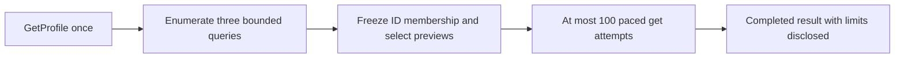

# Mailbox scanner design: bounded V1

Status: proposed read-only design and contracts. The scanner is not wired into the API. MailSweep currently authenticates with `gmail.readonly` and can read `Users.GetProfile("me")`; its API has no scan worker or database. A test mailbox has 72,640 messages and 67,185 threads. V1 deliberately produces a useful **candidate scan within minutes**, not a mailbox inventory.

## V1 promise and hard limits

V1 reports observed counts for three Gmail search cohorts and limited, metadata-only message previews. It does not compute mailbox-wide top senders, newsletter totals, shopping/shipping classifications, or storage savings. A completed scan may be **limited**: each cohort says whether its observed count is complete or merely “at least N.” The byte figure covers only successfully enriched, still-matching messages; it is never extrapolated to all search hits.

These are server-owned defaults. A future implementation can make them configurable after measuring real mailboxes, but the V1 public request accepts no limit values.

| Limit | V1 value | Effect |
| --- | ---: | --- |
| `messages.get` HTTP attempts per scan | **100 total** | Includes retries and failed calls; at most 100 unique messages can be enriched. Reserve a slot before every attempt. |
| Successfully returned list pages per cohort | **20** | At `maxResults=500`, at most 10,000 listed IDs per cohort. |
| `messages.list` HTTP attempts per cohort | **24** | Includes retries; prevents retry amplification beyond the page cap. |
| Distinct observed IDs per cohort | **10,000** | Stop if reached before the final Gmail page. |
| Enumeration wall time per cohort | **45 seconds** | Includes quota waits, requests, and backoff. |
| Overall scan wall time | **5 minutes** | Stop work and return a limited result when the deadline is reached. |
| Metadata get concurrency | **1–2 workers** | Begin with 2; the shared rate limiter, not worker count, controls sustained pace. |

The normal maximum is one profile call, 72 list attempts, and 100 get attempts: `1×1 + 72×5 + 100×20 = 2,361` published quota units. The attempt budgets include retries. A scan can use less. At a two-get-per-second pace, 100 get attempts need at least 50 seconds of pacing; network and backoff add time. If Gmail is slow, the five-minute deadline ends the job with clearly incomplete results. These are service limits, not a promise about Gmail latency. [Gmail usage limits](https://developers.google.com/workspace/gmail/api/reference/quota).

## Frozen search plan

Take `scanStartedAt` once in UTC. Compute `twoYearCutoff = scanStartedAt.AddYears(-2)` and `oneYearCutoff = scanStartedAt.AddYears(-1)` as Unix **seconds**. Substitute their decimal values into the exact `q` templates below. The Gmail API interprets date strings at PST midnight; epoch seconds preserve the frozen cutoff. Validate these queries on a test account because Gmail API search is message-level and does not have every Gmail UI behavior. [Gmail API filtering](https://developers.google.com/workspace/gmail/api/guides/filtering), [search operators](https://support.google.com/mail/answer/7190).

| Priority / identifier | Exact `q` template | Meaning |
| --- | --- | --- |
| 1 — `LargeMail` | `larger:25M -is:starred -is:important -in:sent -in:drafts` | Gmail search matches over its 25M size threshold. This is not sorted by size. |
| 2 — `OldPromotions` | `category:promotions before:{twoYearCutoff} -is:starred -is:important -in:sent -in:drafts` | Promotions older than the frozen two-year cutoff. |
| 3 — `OldUnreadInbox` | `is:unread in:inbox before:{oneYearCutoff} -is:starred -is:important -in:sent -in:drafts` | Old unread inbox clutter. |

Call `Users.Messages.List("me")` for each query with `MaxResults=500`, `IncludeSpamTrash=false`, and a partial response such as `nextPageToken,resultSizeEstimate,messages(id,threadId)`. Follow `nextPageToken` until absent or a limit is reached. Count **distinct message IDs within each cohort**; `resultSizeEstimate` is only an internal hint, never an exact count or percent denominator. A completed cohort has a count observed across all returned pages; a truncated cohort reports **at least** its observed count. Live mailbox changes mean even a completed count is an observation during the scan, not a transactional snapshot. `Messages.List` yields IDs and thread IDs, not message sizes, labels, dates, or headers. [Messages.List reference](https://developers.google.com/workspace/gmail/api/reference/rest/v1/users.messages/list).

Search exclusions reduce paid gets. Recheck `STARRED`, `IMPORTANT`, `SENT`, and `DRAFT` labels after metadata retrieval because a message can change during the scan. Also recheck the cohort's age and label predicates against `internalDate` and current labels where applicable. Gmail's `larger:25M` predicate defines the large-mail cohort; display `sizeEstimate` separately rather than implying that search size and reported estimate use identical accounting. Never add a protected or no-longer-matching message's size to the matching-byte subtotal.

## Enumeration, selection, and enrichment



Finish all three bounded enumerations before enrichment. Hold only ID strings and a three-bit cohort membership mask, plus bounded counters, in memory. At most 30,000 per-cohort observed IDs are possible; overlapping IDs occupy one unique-ID entry. No Gmail `Message` objects or bodies accumulate. If the scan deadline interrupts enumeration, mark the active cohort `Truncated`, leave later cohorts `NotStarted`, and return the observations already available. A missing cohort is not a zero count.

Select unique IDs in priority order before issuing gets. Initially reserve up to **60 get attempts for LargeMail, 25 for OldPromotions, and 15 for OldUnreadInbox**. An ID shared by cohorts is fetched once and contributes to each matching cohort after validation. After these reserved passes, spend unused attempts on still-unenriched IDs in the same priority order; the combined cap remains 100 attempts, including retries. The API must not call this sample “largest messages” because Gmail list order is not a size ranking. Keep the selection deterministic from the returned list order and call it **matching previews**.

Normalize and discard each Gmail response immediately. For a successful get, retain only ID, thread ID, `internalDate`, `sizeEstimate`, current labels, and selected `From` and `Subject` headers for a limited preview. Sum `sizeEstimate` once per unique, enriched message that still matches at least one cohort to obtain `EstimatedMatchingMessageBytes`; per-cohort byte subtotals can overlap. The number is an **approximate size of enriched matches**, not estimated reclaimable storage or the size of every enumerated candidate. Gmail defines `sizeEstimate` as an estimate in bytes. [Message resource](https://developers.google.com/workspace/gmail/api/reference/rest/v1/users.messages).

### First live implementation gate: metadata fields

Before implementing the real scanning adapter, perform a live test on a small, authorized test mailbox. Request one representative message with `Users.Messages.Get`, `Format=METADATA`, `MetadataHeaders=["From","Subject"]`, and a partial field mask including `id,threadId,labelIds,internalDate,sizeEstimate,payload/headers`. Assert that **both** `internalDate` and `sizeEstimate` are reliably returned, along with selected headers. Google's format description promises IDs, labels, and headers, while the general `Message` schema defines date and size; the design must not assume the two extra fields are present in every metadata response. A `fields` mask only removes response fields; it cannot create missing ones. [Format reference](https://developers.google.com/workspace/gmail/api/reference/rest/v1/Format), [Get reference](https://developers.google.com/workspace/gmail/api/reference/rest/v1/users.messages/get), [partial responses](https://developers.google.com/workspace/gmail/api/guides/performance).

If either field is not reliable, choose one fallback mode for the **bounded** adapter: `Format=FULL` with a partial response mask limited to `id,threadId,labelIds,internalDate,sizeEstimate,payload/headers`. Do not request `payload/body`, `payload/parts`, `raw`, or `snippet`. `metadataHeaders` does not filter `FULL` responses, so discard all but `From` and `Subject` locally. Validate the actual .NET client's field-mask spelling and returned shape in this gate. Do **not** try `METADATA` and then `FULL` for every candidate; that doubles get cost. There is no attachment fetch or body analysis in V1.

## Quota pacing, failures, and cancellation

Use a shared limiter keyed by Google project and authenticated mailbox account, across active scans and the API instance's other Gmail calls. Also enforce a project-wide limit using the project's configured quota. Begin with a **smooth target of at most two get attempts per second** (about 2,400 get units/minute), allowing at most a two-get burst, and charge list/profile requests by their published units. This leaves room below the currently published 6,000-unit/minute per-user-per-project limit; actual project limits must be checked before rollout. More get workers cannot overcome a quota-unit limit. Google separately limits concurrent requests for a user. Count actual outgoing HTTP attempts, including any Google client automatic retries: disable hidden retries unless they pass through the same limiter and attempt budgets. [Usage limits](https://developers.google.com/workspace/gmail/api/reference/quota), [error handling](https://developers.google.com/workspace/gmail/api/guides/handle-errors).

On 429, 5xx, or a 403 with a rate-limit reason, pause the shared queue and use `Retry-After` when available or exponential backoff with jitter, beginning at least one second. Cap retries at three attempts for an ID and within the 100-get or 24-list-attempt budgets; **every HTTP retry consumes an attempt slot and quota pacing**. A 404 get counts as an attempt and as an unavailable preview, then scanning continues. Authentication/permission failures stop the job with a safe status reason; they are not rate-limit retries. A scan deadline or budget stop is a normal `Completed` result with `LimitedByBudget=true`, not a false exact count.

Pass the job cancellation token through list/get calls, limiter waits, and backoff delays. `POST .../cancel` stops the in-memory job; a disconnected status request does not. Keep one active scan per account. Do not use a Gmail multipart batch for V1: inner calls still consume their individual quota and larger batches can trigger rate limits. [Batch guidance](https://developers.google.com/workspace/gmail/api/guides/batch).

## Progress and API contracts

The isolated response contracts are under `src/MailSweep.Api/Mailbox/Contracts/`. All endpoints below are proposed, not implemented. They require the authenticated account, per-scan ownership, `Cache-Control: no-store`, and same-origin/CSRF checks on POSTs because authentication uses a cookie. Future endpoint code should serialize enum names as camel-case strings as shown. No V1 request accepts a coverage mode or a client-supplied budget.

| Route | Request → response | Meaning |
| --- | --- | --- |
| `POST /api/mailbox/scans` | Empty body → `MailboxScanProgress`, `202 Accepted` + `Location` | Start the fixed bounded V1 scan; reject a second active scan for the account. |
| `GET /api/mailbox/scans/{scanId}` | No body → `MailboxScanProgress` | Poll overall state, actual stage, three cohort records, observed IDs, and get usage. |
| `POST /api/mailbox/scans/{scanId}/cancel` | Empty body → `MailboxScanProgress`, `202 Accepted` | Request cancellation. |
| `GET /api/mailbox/scans/{scanId}/summary` | No body → `MailboxScanSummary` | Available when `Completed`, including when limited; returns cohort observations, enriched-byte subtotal, and capped previews. |

`MailboxScanStatus` is `Queued`, `Running`, `Completed`, `Cancelled`, or `Failed`. `MailboxScanStage` is only `Enumerating` or `Enriching`; normalization is performed within enrichment. Each `MailboxScanCohortResult` has `EnumerationStatus`, `PagesEnumerated`, `ObservedCandidateCount`, and derived `CountComplete`. `Completed` enumeration means the end page was reached; `Truncated` means a page, ID, time, or scan cap stopped it. If enumeration is complete but only some IDs were enriched, its **count** remains complete while `EnrichedMessages` and byte subtotal remain limited. `LimitedByBudget` is true if any cohort or enrichment stopped due a limit, not merely because the get counter equals 100 when there happened to be exactly 100 candidates. `MessagesAttempted` counts distinct IDs tried; `GetAttemptsUsed` counts HTTP attempts including retries; `GetSucceeded` counts distinct IDs with valid required metadata. Per-cohort enriched counts can overlap. Do not calculate progress as `gets / resultSizeEstimate` or `unique IDs / profile total`.

Example completed but limited status response (illustrative):

```json
{
  "scanId": "712055fc-649f-4429-9f1c-a2e65ce4a1eb",
  "status": "completed",
  "stage": null,
  "cohorts": [
    {"cohort":"largeMail","enumerationStatus":"completed","pagesEnumerated":2,"observedCandidateCount":570,"enrichedMessages":60,"estimatedMatchingMessageBytes":2200000000,"countComplete":true},
    {"cohort":"oldPromotions","enumerationStatus":"truncated","pagesEnumerated":20,"observedCandidateCount":10000,"enrichedMessages":25,"estimatedMatchingMessageBytes":14000000,"countComplete":false},
    {"cohort":"oldUnreadInbox","enumerationStatus":"completed","pagesEnumerated":3,"observedCandidateCount":1030,"enrichedMessages":15,"estimatedMatchingMessageBytes":3100000,"countComplete":true}
  ],
  "uniqueIdsEnumerated": 11420,
  "messagesAttempted": 99,
  "getAttemptsUsed": 100,
  "getAttemptBudget": 100,
  "getSucceeded": 98,
  "limitedByBudget": true,
  "startedAt": "2026-09-17T16:00:00Z",
  "finishedAt": "2026-09-17T16:03:00Z",
  "statusReason": "cohort_page_limit_reached"
}
```

The old Promotions count above is **at least 10,000**, never “exactly 10,000.” `uniqueIdsEnumerated` can be below the sum of cohort counts because queries overlap. Retries or unavailable messages can make `GetSucceeded` lower than `GetAttemptsUsed`. Show no completion percentage for truncated cohorts. An unfinished scan reports only actual pages, IDs, and attempts so far.

Example summary fields:

```json
{
  "scanId": "712055fc-649f-4429-9f1c-a2e65ce4a1eb",
  "ruleVersion": "bounded-v1",
  "profileMessageCount": 72640,
  "cohorts": [
    {"cohort":"largeMail","enumerationStatus":"completed","pagesEnumerated":2,"observedCandidateCount":570,"enrichedMessages":60,"estimatedMatchingMessageBytes":2200000000,"countComplete":true},
    {"cohort":"oldPromotions","enumerationStatus":"truncated","pagesEnumerated":20,"observedCandidateCount":10000,"enrichedMessages":25,"estimatedMatchingMessageBytes":14000000,"countComplete":false},
    {"cohort":"oldUnreadInbox","enumerationStatus":"completed","pagesEnumerated":3,"observedCandidateCount":1030,"enrichedMessages":15,"estimatedMatchingMessageBytes":3100000,"countComplete":true}
  ],
  "uniqueIdsEnumerated": 11420,
  "messagesAttempted": 99,
  "getAttemptsUsed": 100,
  "getAttemptBudget": 100,
  "getSucceeded": 98,
  "estimatedMatchingMessageBytes": 2210000000,
  "limitedByBudget": true,
  "messagePreviews": [
    {"messageId":"18ab123","threadId":"18ab000","matchingCohorts":["largeMail"],"receivedAt":"2025-04-01T12:00:00Z","estimatedBytes":27800000,"from":"Example <news@example.com>","subject":"Monthly update"}
  ],
  "completedAt": "2026-09-17T16:03:00Z"
}
```

The illustrated per-cohort subtotals can overlap, so the overall `estimatedMatchingMessageBytes` is a deduplicated union and need not equal their sum. `messagePreviews` can contain examples from all three cohorts and carries each message's matching cohort IDs. Keep preview rows at or below the bounded enrichment count; never return body text. The `profileMessageCount` is context from Gmail, not a scan denominator or a claim of coverage. Status reasons are safe codes, not raw Gmail error text.

## Memory, lifetime, and future persistence

The V1 worker is in memory on one API instance. It holds at most the bounded ID/membership set, three cohort counters, and up to 100 normalized preview records. Dispose of full Gmail response objects promptly; do not persist message bodies, tokens, or unsubscribe headers. Completed results expire after a short server retention period (for example 30 minutes). A process restart loses the job and the user may start again. This is acceptable because call and time costs are bounded.

The current authentication cookie lasts one hour and the Gmail credential is currently obtained through an authenticated HTTP request. V1 obtains the credential for the short job at start, then must verify in implementation that it remains usable outside that request for the five-minute deadline; stop with an authentication error if it does not. Finishing quickly reduces credential risk but does not prove token renewal. **Deep Scan** is a separate future feature, blocked on a renewable background credential/session design. Only then add lightweight SQLite with a durable ID queue, atomic worker claims/leases, per-query checkpoints, processed markers and aggregate updates in one transaction, restart recovery, and account/rule-version ownership. A unique ID constraint prevents duplicate rows, but cannot by itself prevent concurrent or crash-related repeated Gmail gets. Deep Scan must state its multi-hour quota cost and coverage separately; no `FullMailbox` option is exposed by V1.

## Safety boundary

V1 uses `gmail.readonly` for profile/list/get only. There is no delete, trash, archive, label mutation, send, `gmail.modify` scope, or AI classification. Search results and message IDs are analysis data. Any future cleanup action requires a separate write-scope milestone, fresh preview, explicit user selection, and confirmation. No V1 estimate is called reclaimable storage; that concept is reserved for a future estimate over messages the user has actually selected.

## Implementation milestones

1. **A — Live metadata-field validation:** on a small test mailbox, prove whether `METADATA` returns `internalDate` and `sizeEstimate` with selected headers and the .NET client's field mask. Choose one production get mode; test the body-excluding `FULL` fallback if necessary.
2. **B — Fake-data bounded engine:** implement frozen query templates, distinct-ID cohort counting, all budgets, selection priority, smooth shared limiter, retries, cancellation, and limited-result semantics against fake pages. Test overlapping cohorts, page/time/get limits, retry consumption, and deadline stops.
3. **C — Real Gmail targeted scan:** connect only profile/list/get through the validated adapter, use one in-memory job per account, and measure latency, list sizes, actual quota use, and missing fields on a large test mailbox. Keep all hard limits.
4. **D — Dashboard/progress UI:** display complete counts versus “at least N,” actual pages/gets, matching previews, and the narrow enriched-byte subtotal. Never render a mailbox coverage percentage from Gmail's result estimate.
5. **E — Optional Deep Scan:** separately design renewable credentials, SQLite resumability, multi-hour progress, and mailbox-wide claims before offering it to users.
