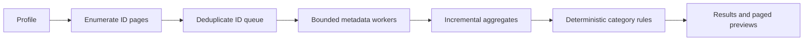

# Mailbox scanner design

Status: proposed contracts and implementation plan. No scanner endpoints or Gmail message calls are wired into the application yet.

## Scope and decision

MailSweep currently has a .NET 10 API, Google sign-in with `gmail.readonly`, and `Users.GetProfile("me")`. It has no background worker or database. A test mailbox has 72,640 messages and 67,185 threads. The scanner must work asynchronously, avoid message bodies, and report what portion of the mailbox it actually analyzed.

**First useful scan:** enumerate a small, versioned set of cleanup-oriented Gmail queries; deduplicate their message IDs; fetch metadata only for those IDs; aggregate results. Its sender ranking describes the **analyzed candidate set**, not every sender in the mailbox. A later `FullMailbox` scan can use the same pipeline to produce mailbox-wide sender rankings. Neither mode implies any Gmail write operation.

The first production implementation intended for a 70k-message account should use a small SQLite job/checkpoint store. An in-memory worker is suitable for the first fake-data vertical slice, but is not a reliable basis for a multi-hour full scan. Keep storage local to this scanner; no generic repository, CQRS, or distributed-job framework is needed.

## Pipeline



| Stage | Input and output | Streaming behavior |
| --- | --- | --- |
| Profile | `GetProfile("me")` gives account identity and rough mailbox totals. | One call at start; totals are context, not the scan denominator. |
| ID enumeration | `Messages.List` pages supply `(id, threadId)` and a query-membership bit set. | Page by page; upsert IDs into a bounded queue or SQLite table. Candidate queries can overlap. |
| Metadata enrichment | `Messages.Get` supplies dates, size estimates, labels, and selected headers. | A few concurrent workers; discard each Gmail response after normalization. |
| Aggregation | Update sender, category, and size counters from one normalized message at a time. | Incremental; a small bounded set of large-message preview rows is retained. |
| Category analysis | Apply versioned, deterministic rules to each normalized message. | Usually fused with aggregation; final sorting/top-N happens at the end. |
| Results | Immutable summary plus paged sender and large-message views. | Status is pollable while the job runs; no request waits for completion. |

`FullMailbox` changes the enumeration input to a single unfiltered list pass. It is a later milestone because complete enrichment is expensive and the current request-bound OAuth credential path and one-hour cookie are not yet a long-running worker credential strategy.

## Gmail acquisition and minimum fields

1. Call `Users.GetProfile("me")` once. Profile `messagesTotal`/`threadsTotal` are not counts of eligible cleanup candidates and may differ from subsequent list results as mail changes.
2. Call `Users.Messages.List("me")` with `MaxResults = 500`, `IncludeSpamTrash = false`, and a `q` for each candidate cohort. Request only `nextPageToken,resultSizeEstimate,messages(id,threadId)` through the standard `fields` partial-response parameter. Follow `nextPageToken` until absent; `resultSizeEstimate` is only a progress hint. `Messages.List` does **not** return dates, sizes, labels, or headers. `labelIds` can additionally filter a single cohort, but multiple supplied IDs are an AND condition. The current `gmail.readonly` scope permits `q`.
3. For each unique ID, call `Users.Messages.Get("me", id)` with `Format = METADATA`, `MetadataHeaders = ["From", "Subject", "List-Id", "List-Unsubscribe", "Auto-Submitted"]`, and a partial response such as `id,threadId,labelIds,internalDate,sizeEstimate,payload/headers`. Validate the exact .NET client's `Fields` spelling in the implementation integration test. Do not request `snippet`, MIME parts, body, attachment bytes, `RAW`, or `FULL`. `MINIMAL` does not provide the headers and size needed for this analysis.
4. Normalize and then release the Gmail `Message` object. Retain `id`, `threadId`, `internalDate` (epoch milliseconds), `sizeEstimate` (bytes), `labelIds`, parsed `From`, and only the selected headers needed by current rules. `Subject` is useful for explainable shopping/shipping rules and the limited large-message preview; do not log it. Do not retain all subjects or payloads.

The message is the unit of counting and estimated size. Thread ID is for grouping and future preview, not a reason to call `Threads.Get` for every message. There is no attachment fetch in V1. Gmail's `internalDate` is generally more suitable for age rules than the mail-supplied `Date` header, with the documented caveat for imported messages. [List method](https://developers.google.com/workspace/gmail/api/reference/rest/v1/users.messages/list), [Get method](https://developers.google.com/workspace/gmail/api/reference/rest/v1/users.messages/get), [Message resource](https://developers.google.com/workspace/gmail/api/reference/rest/v1/users.messages), [partial responses](https://developers.google.com/workspace/gmail/api/guides/performance).

### Candidate query plan

Use a fixed scan start time and rule version. The values below are proposed defaults, not hidden user preferences. Recheck exact age and size against metadata after search; Gmail search is the coarse prefilter. Exclude `SPAM`/`TRASH` at list time and suppress `SENT`, `DRAFT`, `STARRED`, and `IMPORTANT` from the potential-cleanup union after enrichment. Those exclusions are a conservative product rule and can be made user-configurable later.

| Cohort query | Purpose |
| --- | --- |
| `category:promotions older_than:12m` | Old promotions; source set for old newsletters. |
| `category:social older_than:6m` | Old social notifications. |
| `is:unread older_than:12m` | Old unread clutter. |
| `larger:10M` | Large messages; exact threshold checked against `sizeEstimate`. |
| `category:purchases older_than:12m` and `category:updates older_than:12m` | Source set for explainable shopping/shipping notification rules. |

These are examples of Gmail-supported search operators; confirm query behavior with a test mailbox before exposing counts. Search can sharply reduce `Get` calls when the matching union is small. It cannot provide `From`, exact size estimates, or a mailbox-wide high-volume-sender ranking. In candidate mode, old newsletters outside the old Promotions cohort and high-volume senders whose mail never matches a query are outside coverage. The UI/API must say so. A full scan is required for mailbox-wide answers. [Gmail search operators](https://support.google.com/mail/answer/7190).

## Pagination, concurrency, quota, and failure behavior

- Enumerate one query's pages sequentially because each next page needs its prior token. Upsert each page before moving on. A unique constraint on `(scanId, messageId)` prevents overlap from causing duplicate `Get` calls or duplicate estimates. Keep a bounded channel (for example 1,000 IDs) between list and get work, with about four get workers initially. The SQLite ID queue can be larger on disk without growing the in-process queue.
- Apply a per-user **quota-unit** limiter as well as bounded concurrency. Start around 4,000 units/minute per user, below the published 6,000-unit limit, and also enforce the project's configured limit. These are starting controls to tune from actual latency and 429 rates, not throughput promises. Reserve capacity for the rest of the app and other Gmail clients sharing the user limit.
- On 429, 5xx, and 403 responses whose reason is `rateLimitExceeded` or `userRateLimitExceeded`, pause the shared work queue and retry with `Retry-After` where supplied or truncated exponential backoff with jitter, starting at least one second. Bound attempts and expose `Paused`/`Failed` with a reason if the condition persists. A 401 or auth-related 403 needs reconnection, not blind retry. A 404 on an individual message means it vanished during scanning: count it as unavailable and continue. Cancellation tokens must flow through enumeration, get, rate-limit waits, and persistence writes.
- `POST .../cancel` cancels the job's token and drains/stops workers. A browser disconnect cancels only that HTTP request, not the background scan. Progress reports actual enumerated unique IDs and completed metadata gets; its optional estimate can change and must never be treated as an exact percentage. Snapshot consistency is best effort because Gmail can change during a scan; deduplication and unavailable counts make this visible.
- Do not add Gmail multipart batching first. It may reduce connection overhead, but each inner call still consumes its own quota and large batches can increase rate limiting. If measured HTTP overhead later justifies it, use batches of at most 50 with the same unit limiter and per-item error handling. [Gmail batch guide](https://developers.google.com/workspace/gmail/api/guides/batch), [error handling](https://developers.google.com/workspace/gmail/api/guides/handle-errors).

The current published quota table (checked September 2026) lists `getProfile = 1`, `messages.list = 5`, and `messages.get = 20` units, with 6,000 units/minute per user per project. Project age and configuration can affect actual limits; verify them in Google Cloud Console before load testing. For 72,640 messages, an all-message scan requires at least 146 list pages and 72,640 gets: **1 + 146×5 + 72,640×20 = 1,453,531 units**, before retries. Even at the full published user limit, that is about **4.0 hours of quota**. At the proposed 4,000-unit/minute starting limit, the quota-only floor is about **6.1 hours**. A candidate union of 5,000 IDs costs about 100,000 get units plus its list pages; actual time depends on shared quota, latency, and retries. This is why an HTTP request must not own the scan and why a 70k full scan needs checkpoints and credential renewal. Quota units are not network bytes or a guaranteed dollar cost. [Gmail usage limits](https://developers.google.com/workspace/gmail/api/reference/quota).

## Aggregates and deterministic categories

The normalizer emits one compact record per successful get. Increment `analyzedMessages`, a size total, sender counters, and category counters exactly once for each ID. Store only counters and a capped, sortable large-message preview; SQLite provides the durable ID/processing ledger. The category totals **overlap**. Evaluate all message-level rules together and add each eligible message's size at most once to `estimatedPotentialReclaimableBytes`, so it is not the sum of category bytes. `HighVolumeSenders` is a review group derived at finalization; it does not add otherwise unmatched mail to this potential-cleanup union. All byte fields are estimates based on Gmail `sizeEstimate`, not guaranteed storage savings; Gmail's quota accounting and the effects/timing of any later cleanup may differ.

Canonical sender key: parse the first valid mailbox in `From`; trim surrounding whitespace, normalize the domain to lowercase IDNA ASCII, and lowercase the address for a pragmatic grouping key. Keep the original display name only as optional presentation text. Do not strip `+tag`, dots, or subdomains or infer a parent organization. The domain field is the normalized **full domain**, not a registrable-domain calculation. A missing or invalid `From` goes to an `unknown` key with null address/domain. This intentionally trades the theoretical case sensitivity of local parts for stable user-facing grouping. Each normalized message increments count and estimated bytes for its key; `HighVolumeSenders` is derived from those counters at finalization, with the result labeled by scan coverage.

| Category | Initial rule on analyzed messages |
| --- | --- |
| `OldPromotions` | `CATEGORY_PROMOTIONS` and age ≥ 12 calendar months. |
| `SocialNotifications` | `CATEGORY_SOCIAL` and age ≥ 6 calendar months. |
| `OldUnread` | `UNREAD` and age ≥ 12 calendar months. |
| `LargeMessages` | `sizeEstimate` ≥ 10 MiB (10,485,760 bytes). |
| `HighVolumeSenders` | Sender has ≥ 100 analyzed messages; report the sender's analyzed count and bytes as a review group, with candidate-only or full-mailbox coverage stated. |
| `OldNewsletters` | Age ≥ 12 months, in the old Promotions source set, and a nonempty `List-Id` or `List-Unsubscribe` header. This deliberately misses newsletters outside that source set in candidate mode. |
| `OldShoppingNotifications` | Age ≥ 12 months, in `CATEGORY_PURCHASES` or `CATEGORY_UPDATES`, plus a versioned subject/sender rule for order, shipping, delivery, or receipt notifications. Keep the matching rule visible in a future preview; uncertain cases remain unclassified. |

Rule thresholds and terms must be versioned with results. Use exact label membership and metadata as final checks because search cohorts can overlap and mailbox state may change. No AI classifier is needed for V1. A high-volume sender is a **review suggestion**, not a claim that every message from that sender is safe to remove. Protected labels are excluded from the potential-reclaimable union even if a category matches. The `HighVolumeSenders` category total is the sum of qualifying sender aggregates and may include protected mail; it is informational and is not part of the union estimate by itself.

## Persistence and resumability

| Option | Fit for this project |
| --- | --- |
| In-memory one-session worker | Smallest first vertical slice with fake data and small candidate sets. A restart loses progress and multi-hour scans exceed the present request/cookie lifetime. Do not market it as a complete 70k scan. |
| Lightweight SQLite | **Recommended for the first real 70k-message milestone.** Store job owner, status, rule version, query/page checkpoint, unique ID queue/processed marker, aggregates, and capped preview rows. No message bodies or raw credentials. A single local API instance is sufficient initially. |
| Resumable checkpointing | Implement on the SQLite tables, not as a separate platform. Commit a list page and its next token atomically; commit a message's processed marker and aggregate changes atomically. If a page token expires, restart that query from its first page and deduplicate by ID. Resume only the same account and rule version. |

SQLite does not solve authentication. The current Google credential comes from an authenticated HTTP context, and the cookie lifetime is one hour. Before enabling unattended full scans, establish a secure, renewable credential path or pause a job with `reauth_required` and resume after the account reconnects. Do not serialize bearer tokens into the scan database. A small candidate scan may complete within the existing session; if it does not, pause cleanly. Give completed jobs a short retention period, delete expired job data, and avoid storing subjects except capped previews. Multi-instance deployment would require a different job lease/store strategy and is outside V1.

## Proposed HTTP API and code contracts

All routes below are **proposals** under `/api/mailbox/scans`; none is implemented. They require the existing authenticated account, per-scan ownership checks, and `Cache-Control: no-store`. Mutating scan-control POSTs need same-origin/CSRF protection because auth uses a cookie. They never change Gmail. Return `401` for no session, `404` for a missing or other-account scan, `409` for a duplicate active scan or a result requested before completion, and an explicit retryable error/status for quota or reauthentication. Poll every few seconds with backoff; no long-held HTTP response.

The isolated C# DTOs/enums live in `src/MailSweep.Api/Mailbox/Contracts/`. The future endpoint layer should serialize enum names as strings in camel case, as shown below, and use camel-case JSON properties. These records deliberately contain no Gmail SDK types or persistence concerns. `FullMailbox` is a future capability and should be rejected until its worker, checkpointing, and credential renewal are ready.

| Route | Typed request → response | Behavior |
| --- | --- | --- |
| `POST /api/mailbox/scans` | `StartMailboxScanRequest` → `MailboxScanProgress`, `202 Accepted` + `Location` status URL | Start one job per account; caller chooses `candidateQueries` (initially) or, later, `fullMailbox`. |
| `GET /api/mailbox/scans/{scanId}` | no body → `MailboxScanProgress` | Status, stage, actual counters, optional estimate, timestamps, reason if paused/failed. |
| `POST /api/mailbox/scans/{scanId}/cancel` | no body → `MailboxScanProgress`, `202 Accepted` | Request cancellation; polling eventually shows `cancelled`. |
| `GET /api/mailbox/scans/{scanId}/summary` | no body → `MailboxScanSummary` | Available only after `completed`; includes coverage, unavailable count, union estimate, category totals. |
| `GET /api/mailbox/scans/{scanId}/senders?limit=50&cursor=...` | query limit/cursor → `MailboxScanPage<SenderSummary>` | Sorted by count then key; opaque cursor, max limit 100. Counts reflect summary coverage. |
| `GET /api/mailbox/scans/{scanId}/large-messages?limit=50&cursor=...` | query limit/cursor → `MailboxScanPage<LargeMessageSummary>` | Sorted by estimated bytes then ID; capped retained results and opaque cursor. |

Example start request and immediate response:

```http
POST /api/mailbox/scans
Content-Type: application/json

{"coverage":"candidateQueries"}
```

```json
{
  "scanId": "712055fc-649f-4429-9f1c-a2e65ce4a1eb",
  "status": "queued",
  "stage": null,
  "enumeratedMessages": 0,
  "enrichedMessages": 0,
  "estimatedMessages": null,
  "startedAt": null,
  "finishedAt": null,
  "statusReason": null
}
```

Example completed summary (illustrative numbers; category counts and bytes can overlap):

```json
{
  "scanId": "712055fc-649f-4429-9f1c-a2e65ce4a1eb",
  "coverage": "candidateQueries",
  "ruleVersion": "v1",
  "profileMessageCount": 72640,
  "enumeratedMessages": 4800,
  "analyzedMessages": 4798,
  "unavailableMessages": 2,
  "estimatedPotentialReclaimableBytes": 2950000000,
  "categories": [
    {"category":"oldPromotions","messageCount":2900,"estimatedBytes":1250000000},
    {"category":"largeMessages","messageCount":430,"estimatedBytes":1800000000}
  ],
  "completedAt": "2026-09-17T17:00:00Z"
}
```

Example paged responses:

```json
{"items":[{"key":"news@example.com","emailAddress":"news@example.com","domain":"example.com","displayName":"Example News","messageCount":318,"estimatedBytes":85421000}],"nextCursor":null,"isTruncated":false}
```

```json
{"items":[{"messageId":"18ab123","threadId":"18ab000","receivedAt":"2025-04-01T12:00:00Z","estimatedBytes":15728640,"from":"Example <news@example.com>","subject":"Monthly update"}],"nextCursor":null,"isTruncated":false}
```

The large-message page contains limited header text for user review. Never return bodies. If the retained preview cap is reached, set `isTruncated: true`; the category summary can still represent the full analyzed set. Keep cursor ordering stable on completed immutable results.

## Safety boundary

The scanner uses `gmail.readonly` and only Gmail profile, list, and get calls. Its result IDs and estimates are analysis data, not action instructions. No delete, trash, archive, label modification, send, `gmail.modify`, or write endpoint belongs in this milestone. A later action milestone must separately obtain write scope and require a current preview, explicit message selection, and confirmation. Revalidate selected IDs and ownership at action time; never infer consent from a scan result.

## Independently buildable milestones

1. **Fake-data core:** define a narrow async `ListPage`/`GetMetadata` gateway with cancellation; build the normalizer, deterministic rules, and streaming aggregators against fake Gmail pages. Test overlapping queries, missing messages, category union bytes, and cancellation. An in-memory runner is enough for these tests.
2. **Gmail adapter and quota control:** map the existing Google .NET client's profile/list/get calls to that gateway, with `METADATA` and selected fields, 500-ID pages, bounded workers, per-user quota limiter, and reason-aware retries. Validate response field selection and search semantics on a small test mailbox.
3. **Durable job runner:** add the small SQLite queue/checkpoint/aggregate store, job ownership, cancellation, retention, and restart recovery. Add credential pause/reconnect behavior before enabling full scans. This can be developed in parallel with the Gmail adapter once gateway and contracts are fixed.
4. **HTTP surface:** add start/status/cancel/summary/paged result routes, enum serialization, auth/CSRF and owner checks, no-store headers, and integration tests with fake jobs. Can proceed in parallel with the adapter and durable runner against the shared contracts.
5. **Candidate scan rollout:** enable the versioned query set, coverage wording, and conservative storage estimate. Measure actual Gmail call count, wall time, 429s, and memory on a large test account before tuning concurrency or batch use.
6. **Full-mailbox option:** only after durable resume and renewable auth work, enable the unfiltered ID pass for mailbox-wide sender statistics. Preserve the same read-only boundary and report the multi-hour cost and progress honestly.

## Source notes

Gmail method behavior, message fields, pagination, search, quotas, retries, and batching above are based on the linked Google documentation. Quota tables can change; recheck them and the project's effective settings before implementation or load tests. The package already referenced by this repository is `Google.Apis.Gmail.v1` 1.75.0.4225; the design requires no new Gmail package or scope.
